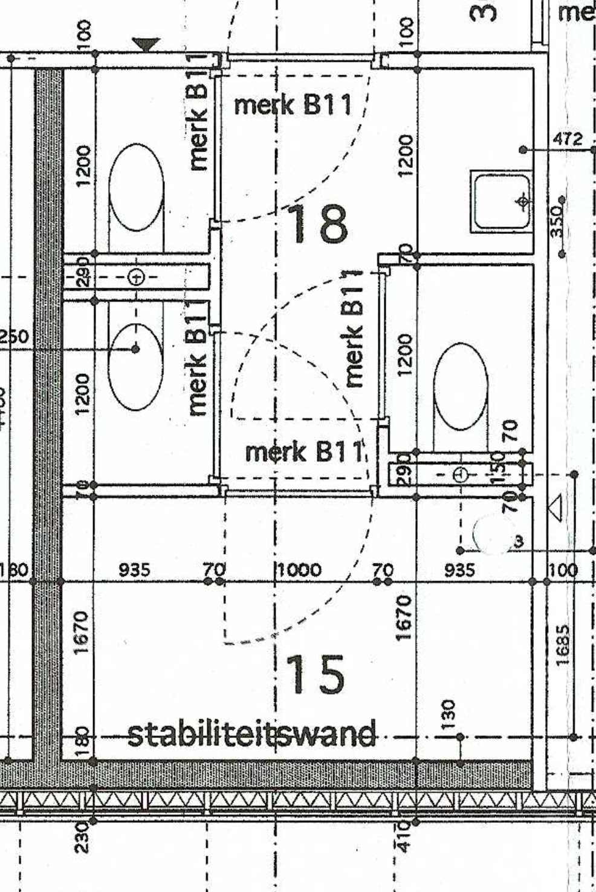
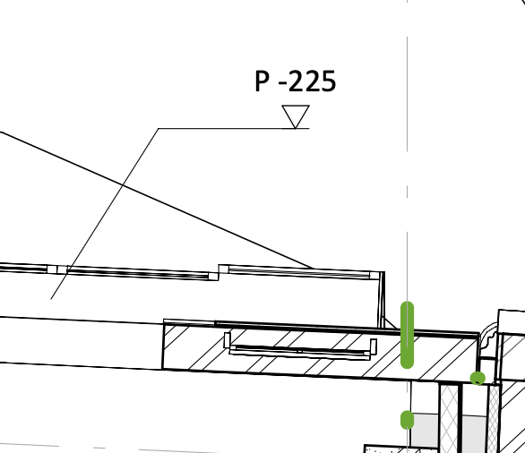

<!-- .slide: data-menu-title="Frontpage"; data-background-image="images/accessibility4picsSmall.png"; data-state="img-top"; data-background-opacity="0.2"; background-size:contain -->
# Tekening lezen op Toegankelijkheid
24-9-2025

Note:
- Printen: kan vanuit Chrome met url suffix: ?print-pdf
- f = full screen (escape to exit)
- o = overview slides
- g = go to slide
- s = speaker notes
- v,b,.,/ = pause/resume

---

<!-- .slide: data-menu-title="Inhoudsopgave"; data-background-image="images/accessibility4pics.png"; data-background-opacity="0.1"; background-size:contain -->
# Inhoudsopgave

 1. Inleiding
 2. Renvooi/Legenda
 3. Codering
 4. Lijntypes
 5. Vloerhoogtes
 6. Deuren
 7. Trap, Lift en hellingbaan
 8. Doorsnedes

---

<!-- .slide: data-menu-title="Inleiding"; data-background-image="images/accessibility4pics.png"; data-background-opacity="0.1"; background-size:contain -->
# Inleiding

- Training tekening lezen kost meestal 5 dagdelen
- Detaillering tekening afhankelijk van fase: schetsontwerp, globaal ontwerp, definitief ontwerp, detail ontwerp
- Vragen graag tussendoor

---

<!-- .slide: data-menu-title="Renvooi/Legenda"; data-background-image="images/accessibility4pics.png"; data-background-opacity="0.1"; background-size:contain -->
# Renvooi/Legenda

- duiding gebouw / etage / bouwdeel
- datum
- codering

--

<!-- .element height="80%" width="80%" -->

--

<!-- .element height="90%" width="90%" -->

---

<!-- .slide: data-menu-title="Codering"; data-background-image="images/accessibility4pics.png"; data-background-opacity="0.1"; background-size:contain -->
# Codering

- Verklaring symbolen
- Staat soms bij renvooi/legenda
- Bevat niet betekenis algemene lijntypes

--

<!-- .element height="80%" width="80%" -->

--

<!-- .element height="60%" width="60%" -->

---

<!-- .slide: data-menu-title="Lijntypes"; data-background-image="images/accessibility4pics.png"; data-background-opacity="0.1"; background-size:contain -->
# Lijntypes

- Dikke lijn: contouren product
- Dunne lijn: maatvoering
- Hartlijn: Hart van symmetrisch onderdeel

--

<!-- .element height=" 50%" width="50%" -->

--

<!-- .element height=" 58%" width="80%" -->

---

<!-- .slide: data-menu-title="Vloerhoogtes"; data-background-image="images/accessibility4pics.png"; data-background-opacity="0.1"; background-size:contain -->
# Vloerhoogtes

Voorbeelden vloerhoogte (peil)

--

<!-- .element height=" 70%" width="70%" -->

--

<!-- .element height=" 40%" width="40%" -->

---

<!-- .slide: data-menu-title="Deuren"; data-background-image="images/accessibility4pics.png"; data-background-opacity="0.1"; background-size:contain -->
# Deuren

Aandacht voor:
- Breedte
- Draairichting

--

<!-- .element height=" 60%" width="60%" -->

---

<!-- .slide: data-menu-title="Trap, lift en hellingbaan"; data-background-image="images/accessibility4pics.png"; data-background-opacity="0.1"; background-size:contain -->
# Trap, lift en hellingbaan

Let op:
- Vrij oppervlak voor lift
- Schuifdeur of draairichting
- Helling percentage

--

<!-- .element height="40%" width="40%" -->

---

<!-- .slide: data-menu-title="Doorsnedes"; data-background-image="images/accessibility4pics.png"; data-background-opacity="0.1"; background-size:contain -->
# Doorsnedes

Voorbeelden doorsnedes

--

<!-- .element height=" 70%" width="70%" -->

--

<!-- .element height="70%" width="70%" -->

--

<!-- .element height="30%" width="30%" -->

--

#<!-- .element height="80%" width="80%" -->

---

<!-- .element height="90%" width="90%" -->

<!-- .slide: data-menu-title="Bedankt voor uw aandacht!"; data-background-image="images/accessibility4pics.png"; data-background-opacity="0.1"; background-size:contain -->
**Bedankt voor uw aandacht!**
