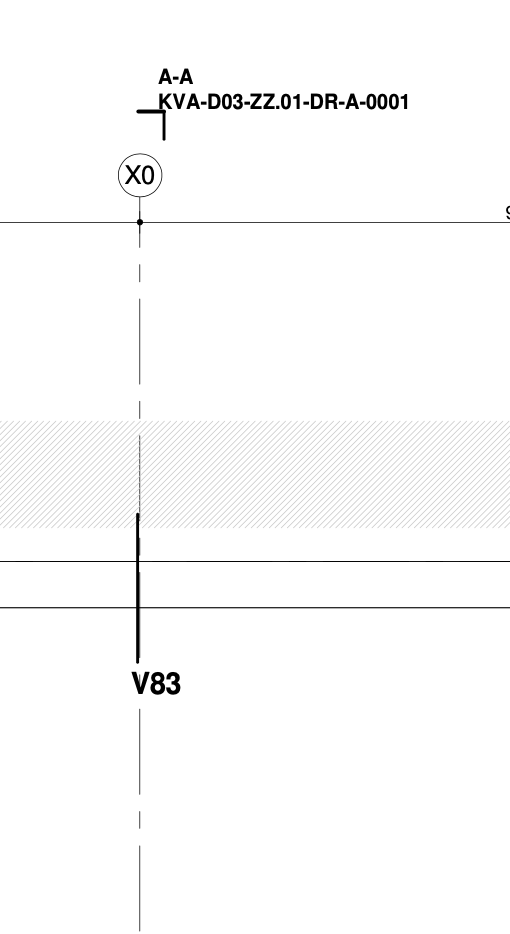

# Tekening lezen op toegankelijkheid
24-9-2025

Note:
- Printen: kan vanuit Chrome met url suffix: ?print-pdf
- f = full screen (escape to exit)
- o = overview slides
- g = go to slide
- s = speaker notes
- v,b,.,/ = pause/resume
- Training tekeninglezen kost typisch 5 dagdelens

---

# Inhoudsopgave

 1. Renvooi/Legenda
 2. Doorsneden
 3. Vloerhoogtes
 4. Lijntypes
 5. Getal
 6. Symbool
 7. Trap en Lift

---

# Renvooi/Legenda

Voorbeelden
- duiding gebouw / etage / bouwdeel
- datum
- codering

--

<!-- .element height="80%" width="80%" -->

--

<!-- .element height="90%" width="90%" -->

--

<!-- .element height="80%" width="80%" -->

--

<!-- .element height="60%" width="60%" -->

---

# Doorsnedes

Voorbeelden doorsnedes

--

<!-- .element height=" 70%" width="70%" -->

--

<!-- .element height="70%" width="70%" -->

--

<!-- .element height="30%" width="30%" -->

--

#<!-- .element height="80%" width="80%" -->

---

# Vloerhoogtes

Voorbeelden vloerhoogte (peil)

--

<!-- .element height=" 70%" width="70%" -->

--

<!-- .element height=" 40%" width="40%" -->

---

# Lijntypes

- Dikke lijn: contouren product
- Dunne lijn: maatvoering
- Streepjes of streepstippellijnen: hulplijnen
- Dunne stippellijn: "onzichtbaar" iets, wel aanwezig maar niet in het zicht
- Hartlijn: Hart van symmetrisch onderdeel

---

# Symbool

- R: radius (straal)
- ø: diameter
- Mx/Gx: schroefdraad Metrisch/Gasdraad (2e cirkel 3/4 ingetekend)
- Gelijkzijdige driekoek in de lengte: Helling bovenaanzicht

---

# Deuren

- Breedte
- Draairichting

